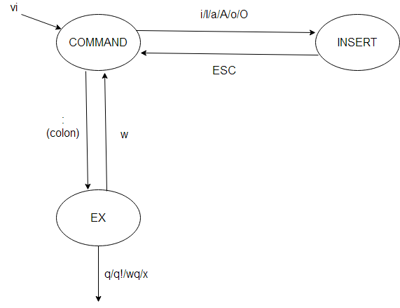

"# WSL" 

wsl --install
Enable-WindowsOptionalFeature -Online -FeatureName Microsoft-Windows-Subsystem-Linux

wsl --version
wsl date

Disable-WindowsOptionalFeature -Online -FeatureName Microsoft-Windows-Subsystem-Linux

wsl.exe --list --online  // wsl -l -o
wsl --install -d Ubuntu

wsl --set-default-version <Version#>
wsl -s Debian
wsl npm init

wsl
htop 

ls -la
dir
pwd

cd

mkdir
touch

vi 
code

uname
whoami

cat ~/.bashrc
sudo apt install sl

sudo apt update
lsb_release -a
apt list --upgradable

sudo add-apt-repository universe multiverse
hwe-support-status --verbose

sudo apt install pacman
sudo pacman -S sl

sudo apt install bastet
bastet

sudo apt install ninvaders
ninvaders

sudo apt install pacman4console
pacman4console

sudo apt install nsnake
nsnake

sudo apt install greed
greed

sudo apt install bsdgames
man atc
atc
backgammon

sudo apt install moon-buggy
moon-buggy

sudo apt install 2048
wget https://raw.githubusercontent.com/mevdschee/2048.c/master/2048.c
gcc -o 2048 2048.c

sudo apt install nudoku
nudoku

sudo adduser Admin --force-badname
cat /etc/passwd
sudo passwd Admin
su Admin

man sudo_root

ssh username@ssh.server.com
ssh username@12.34.56.78
ssh linuxbabe@192.168.0.101

ssh-keygen -t rsa -b 4096
cat .ssh/id_rsa.pub

sudo mkdir ~/.ssh
sudo nano ~/.ssh/authorized_keys
sudo chmod 600 ~/.ssh/authorized_keys

:q to quit (short for :quit)
:q! to quit without saving (short for :quit!)
:wq to write and quit
:wq! to write and quit, attempting to force the write if the file lacks write permission
:x to write and quit; like :wq but writes only if modified (short for :exit)
:qa to quit all (short for :quitall)
:cq to quit, without saving, with a nonzero exit code to indicate failure (short for :cquit)

sudo apt install apt-transport-https
sudo apt update
sudo apt install code

sudo apt update
sudo apt install snapd
sudo snap install --classic code
sudo snap remove --purge code

sudo snap install minikube
sudo snap remove minikube

mkdir helloWorld && cd helloWorld
echo 'print("hello from python on ubuntu on windows!")' >> hello.py

cd /mnt
cd c/

sudo apt install python3 python3-pip
python3 --version
python3 hello.py

rm -rf ~/snap/minikube

rm -f /usr/bin/code 
sudo ln -s /usr/share/code/bin/code /usr/bin/code

sudo apt update && sudo apt upgrade -y

source ~/.bashrc
. ~/.bashrc

alias refreshenv="bash;exit"

ls # list directory contents
mkdir testing # make directory
cd testing # move into directory
touch somefile.txt # create a file
cat somefile.txt # read a file
vim somefile.txt # edit a file with vim
code somefile.txt # edit a file with vscode

sudo apt update
sudo apt upgrade -y

export PS1="\w$ " # full working dir
export PS1="\W$ " # basename of working dir
export PS1="\u@\W $ " # username @ working dir
export PS1="[\t] \u@\h:\w\$ " # timestamp + username + host + working dir

\w full working directory
\W basename of the current working directory
\h hostname
\u username
\t time 24-hour HH:MM:SS
\T time 12-hour HH:MM:SS
\@ time 12-hour am/pm

sudo apt install zsh
sh -c "$(curl -fsSL https://raw.githubusercontent.com/ohmyzsh/ohmyzsh/master/tools/install.sh)"

sudo apt-get install fonts-powerline
code ~/.zshrc # to customize it

apt install nodejs
console.log(process.platform)
node script.js
linux

curl -o- https://raw.githubusercontent.com/nvm-sh/nvm/v0.39.7/install.sh | bash
plugins=(git nvm) ~/.zshrc 
nvm install --lts
nvm use 16
node -v
npm -v

sudo apt install git
git --version
git config --global user.name "Clever Coder"
git config --global user.email "clever@coding.ai"
git config --global credential.helper cache --timeout=2628000

sudo apt autoremove && sudo apt update

sudo apt install gh
gh issue list --repo fireship-io/fireship.io

Google Chrome - Best for JS Debugging
Mozilla Firefox - Best for CSS Debugging
Brave - See how your site behaves on a privacy-conscious environment

Get-PoshThemes
oh-my-posh get shell
New-Item -Path $PROFILE -Type File -Force
notepad $PROFILE
oh-my-posh init pwsh --config 'C:\Users\cleve\AppData\Local\Programs\oh-my-posh\themes\cloud-native-azure.json' | Invoke-Expression
. $PROFILE

cd C:\Users\cleve\AppData\Local\clink\
notepad oh-my-posh.lua
load(io.popen('oh-my-posh init cmd'):read("*a"))()
load(io.popen('oh-my-posh init cmd --config C:/Users/cleve/AppData/Local/Programs/oh-my-posh/themes/dracula.omp.json'):read("*a"))()

code ~/.bashrc # vscode 
vim ~/.bashrc # vim

